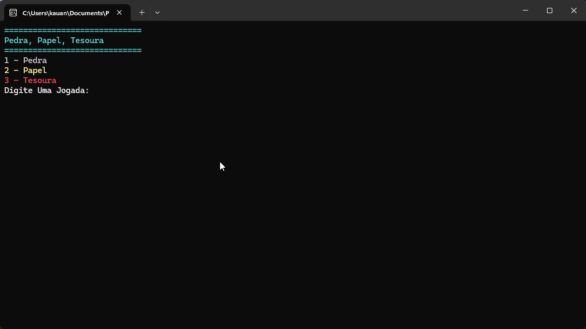

# Pedra, Papel, Tesoura

Pedra, Papel, Tesoura e um clássico, o usuário escolhe entre três opções e o computador escolhe um aleatorio e decide quem ganha.

1. Pedra perde para Papel

2. Papel perde para Tesoura

3. Tesoura perde para Pedra

Projeto feito em C# na Academia Do Programador Full-Stack

## Como Usar?

1. Clone o repositório ou baixe o código comprimido em .zip.
2. Abra o emulador de terminal e navegue até a pasta raiz.
3. Utilize o comando abaixo para restaurar as dependências do projeto.

   ```
   dotnet restore
   ```

4. Em seguida compile e execute o projeto com o comando:

   ```
   dotnet run --project Calculadora.ConsoleApp
   ```

## Requisitos

- .NET SDK 10.0+


